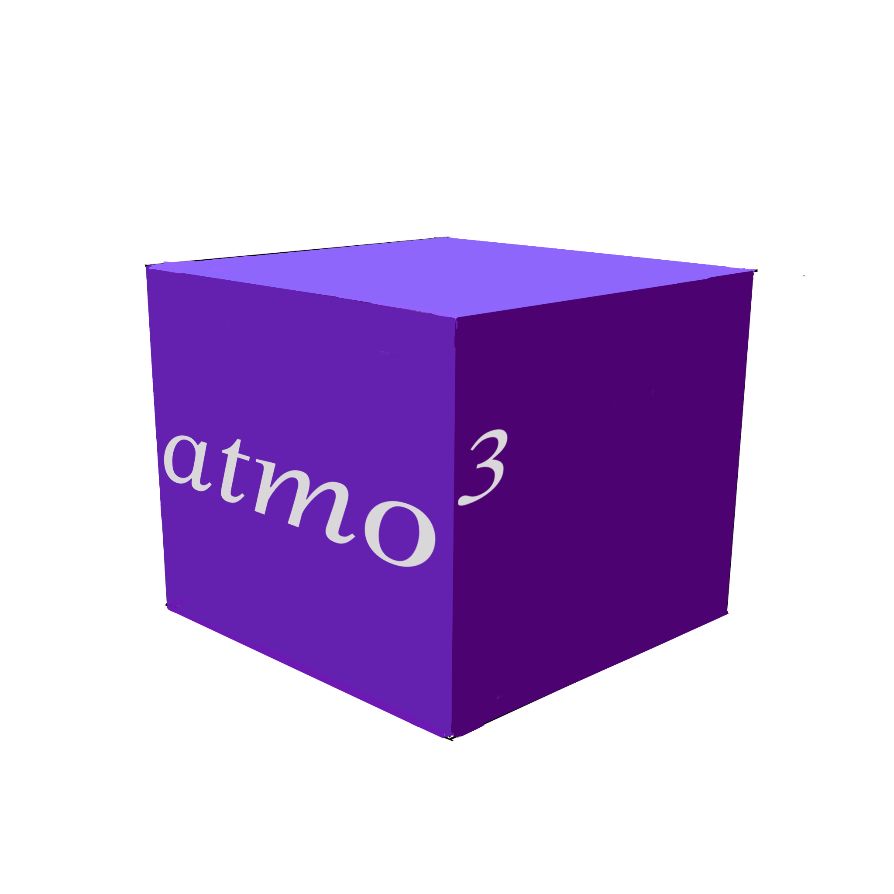

# atmo3

Atmo(sphere) cube - a simulation cube for atmospheric emissions in the microwave

### Installation

1. Dependencies: `jax` and `numpy`
2. Clone this git repository: `git clone git@github.com:1cosmologist/atmo3.git`
3. Enter the top level directory: `cd atmo3`
4. Install: `pip install .`

### Testing
`python ./examples/test_cube.py`